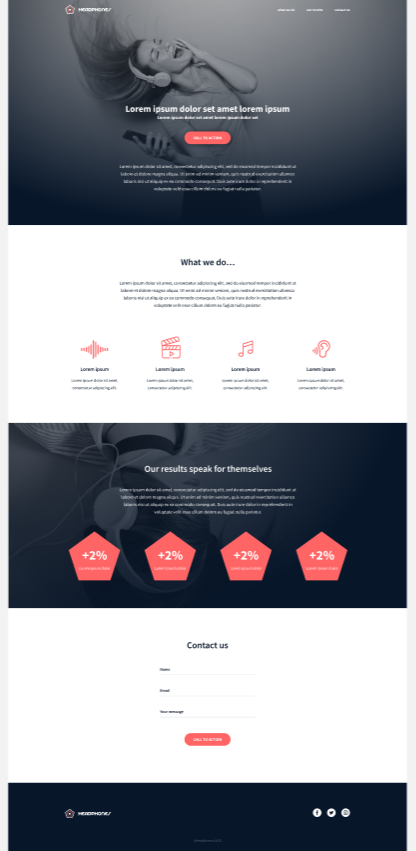

# Headphone Website

 
In this project, we are meant to implement from scratch, without any library, a web page. we will use all HTML/CSS/Accessibility/Responsive design knowledges that you learned previously.
This webpage has been designed by Nicolas Philippot, UI/UX designer.
We don't have a lot of instruction, we are free to implement it the way that we want - the objective is simple: Have a fully functional web page that looks the same as the designer file below.

# Requirements

- you are not allowed to import external CSS framework (like Bootstrap)
- you are not to use Javascript

